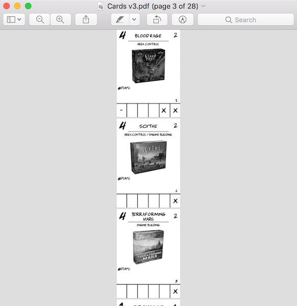
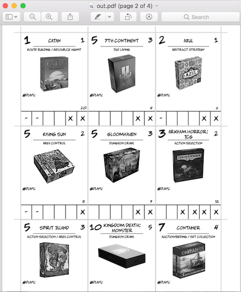

# NineUp

Are you tabletop game designer tired of adding individual card assets into a "9-up" template by hand?

(If not, this project probably isn't for you...)

NineUp is a CLI tool that transforms pdfs with individual card pages into "9-up" pages, i.e. pre-filled templates with 9 cards to a page that are ready to cut :scissors: :sparkles: :exclamation:

It turns this:




Into this:





## Requirements:
Only tested on mac; YMMV on Linux or elsewhere.

* Node (tested on v10.0.0)
* Yarn

## Setup

```
$ mkdir ~/.nineup && cd ~/.nineup && git clone git@github.com:jdwolk/nineup.git && cd ./nineup && yarn install && yarn link
```

Note that if you're using a version manager like [asdf](https://github.com/asdf-vm/asdf) you may need to rehash and/or reshim:

```
$ asdf reshim nodejs
```

## Running

```
$ nineup --pdf ./AllCards.pdf --out ./out.pdf
```

This will create .jpg files for all pages (cards) in `AllCards.pdf` and output the 9-up file to `out.pdf`. The created .jpg files will live in the same directory as `AllCards.pdf`.

If you want to supply your own images, you can pass the `--dir` option instead of `--pdf`:

```
$ nineup --dir ./dir-with-imgs --out out.pdf
```

This will skip the step where images are created from a supplied PDF.

## TODO

* Get PNGs working; JPGs suck
  * Right now PNGs are busted in PDFKit, the lib used to generate the PDF: https://github.com/devongovett/pdfkit/issues/766
* GUI tool?
